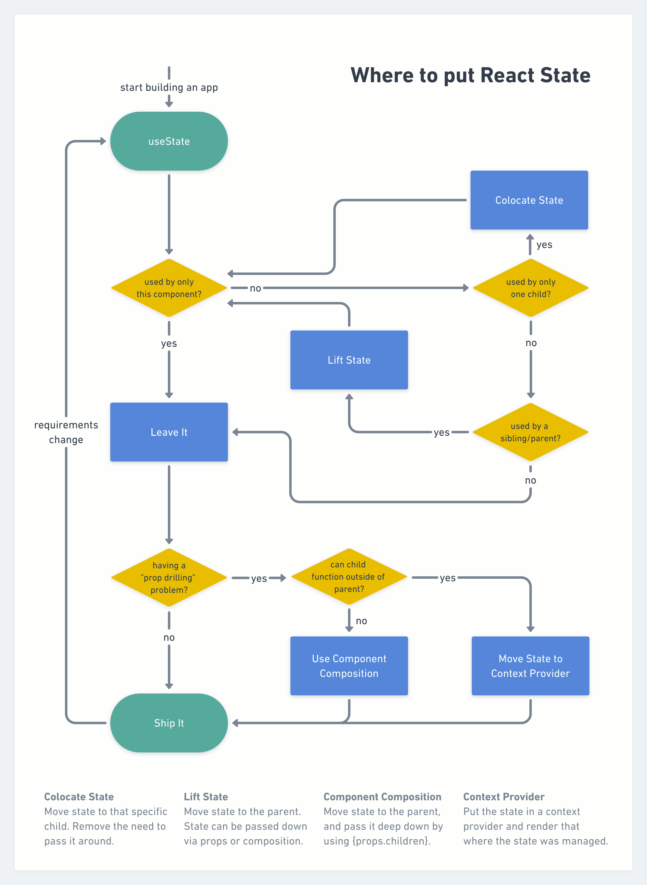

# React-State-Management
A interactive crash course in state management principles and optimizing your front-end applications for performance.

This small project was created as part of a live presentation. The session taught my engineering team about the effects mis-managed state can have on your applications, and how to effectively compose apps and components to avoid state-management foot guns.

## Running this demo
1. Clone this repo to your local machine.
2. Navigate to the folder in your terminal and run `npm i` to install dependencies.
3. Run the app in development mode with `npm run dev` and visit http://localhost:3000 in your browser.

For the best experience, I recommend you install the React Devtools browser extension if you haven't already, and enable highlights on re-renders.

# State Management in React
State management in React, a debate as old as React itself and it only becomes more complex each year as the framework evolves and the community creates more approaches to how and where you store the UI state required to drive your front-ends.

The aim of this document is to provide some good working principles for how to contain your UI State with the tools provided by React. By **no** means are any of the ideas in this document **hard and fast rules**, they are a collection of opinions I’ve developed over the course of my career that help organise code in a semi-sensible way erring on the side of optimal performance. I’m not going to speak on state management and frameworks like Redux, MobX, Zustand and the like, as these solve a different problem and are a very large discussion, full of opinions.


*https://kentcdodds.com/blog/state-colocation-will-make-your-react-app-faster*

**NOTE:**
The examples within this document are using snippets that include components from [Chakra UI](https://chakra-ui.com/). They are all just time-saving abstractions on native HTML elements, so anything done in these examples can also be applied to any other component set-up.

## What do we mean by *State?*

To provide some context for this document, I've been using the term “*UI State”* so far. This is to try and draw a line between the local constantly-changing “state” used to represent the current state of our UI components, and the *server* state, the persistent data held in our databases.

### On server state:

To cover this quickly, I recommend using and abstracting on top of [React Query](https://react-query.tanstack.com/). This is a nicely built package which handles data queries and mutations, re-fetch and retry logic and cache in a pretty clean way.

## Co-location and Performance

React triggers a component re-render for a few conditions:

- Update of a `useState` value.
- Update of a prop passed to the component.
- The parent re-rendered.

With these conditions in mind, we can begin to see some ways to optimise the performance of our interfaces. If changes in props cause re-renders, its a good idea to avoid prop-drilling when possible, and if an update to the `useState` value triggers the component to re-render, its also a good idea (possibly counter-intuitively) to try and push our state down as low as it can get in the component tree. This is essentially what it means to **colocate** state.

Lets take a look at an example:

```tsx
export interface SluggishCounterProps {
	count: number;
	onCount: () => void;
}

const SluggishCounter: FC<SluggishCounterProps> = ({ count, onCount }) => {
	return <Button onClick={onCount}>Count is {count}</Button>;
};

const ParentComponent = () => {
    const [count, setCount] = useState(1);

	const handleCount = () => {
		setCount((prev) => prev + 1);
	};

	return (
		<div>
			{... sibling components}
			<SluggishCounter count={count} onCount={handleCount} />
		</div>
	)
}
```

Right, so here we have a typical example of a Counter component, its just a button that accepts a count and a count handler to increment the count. Seems sane, however it leaves us with a major issue. Because this component is triggering a state update in its parent, all of the sibling components will re-render as well, as any call to the `setState` in a component will re-render the entire tree from that node downwards.

```tsx
const ColocatedCounter: FC = () => {
	const [count, setCount] = useState(1);

	const handleCount = () => {
		setCount((prev) => prev + 1);
	};

	return <Button onClick={handleCount}>Count is {count}</Button>;
};

const ParentComponent = () => {
	return (
		<div>
			{... sibling components}
			<ColocatedCounter />
		</div>
	)
}
```

In this new example, we have taken our state previously passed down from the parent, and pushed it further down into the only component concerned about the current state of `count`. The effect of this is that the only component re-rendering on our page is the Counter component itself. Much more optimal.

### Caveats

Sometimes we run into circumstances that where sibling components care about a components state, maybe we have another component that cares about the value of `count` for this example. This is where you as a developer need to employ your best judgement around what the appropriate response is.

Some solutions to this include (in order of what you should probably consider first):

- Re-thinking your component composition (more on this soon).
- Lifting state up to the closest common parent (possibly make a new parent for the related components).
- Employ the use of Context Provider (and memoization if needed).

## Component Composition

In the early days of your React front-end adventures, its quite common for your component structures to look something similar to this:

```tsx
const App = () => {
	return (
		<Layout>
			<Navigation />
			<Content />
			<Sidebar />
			<Footer />
        </Layout>
	)
};
```

Initially this isn’t a big deal, however, what issues do we run into when some components in our DOM tree start to depend on values from other sibling components? Lifting state and prop-drilling is a major one, which many developers quickly reach to a global state solution like Context API or a State Management Framework (guilty as charged). Before going forward with global state, it pays to pause and have a think about the composition of your components to more easily pass around state.

Continuing with the above example, lets say our `<Content />` component contained a bit of typography that wanted to greet our user when they load the page, and to achieve this, required the `firstName` attribute from the `user` object currently stored within the root `App` component (an arbitrary example, I've got a day to prepare all of this, please cut me some slack). While we are at it, lets say we also have a `Logout` button in our `<Navigation />` component that needs to do something with the user object as well.

```tsx
const App = () => {
    const [user, setUser] = useState({
      firstName: "Jo",
      lastName: "Smith",
   })

   const handleLogout = () => {
    setUser({
      firstName: "",
      lastName: ""
    })
   }

	return (
		<Layout>
			<Navigation onLogout={handleLogout} />
			<Content firstName={user.firstName} />
        </Layout>
	)
};

const Navigation = ({ onLogout}) => {
  return (
      <FlexBox padding={8} justifyContent="space-between">
        <Heading>Arbitrary Application Header</Heading>
        <Button onClick={onLogout}>Logout</Button>
      </FlexBox>
    )
}

const Content = ({ firstName }) => {
  return (
      <ContentBox>
        <Greeting name={firstName} />
        <OtherStuff />
      </ContentBox>
    )
}

const Greeting = ({ name }) => {
  return (
      <ContentBox>
        <Heading>Hello {name}</Heading>
        <Text>So glad you could make it!</Text>
      </ContentBox>
    )
}
```

Alright, now we see the mess we have caused, we’ve got prop drilling! 1 level of drilling into the `<Navigation />` component to get the logout handler into the button, and 2 levels of drilling to get the users `firstName` down into the `<Greeting />` component, a relatively tame example. The main problem here is not so much performance and re-renders, but more the developer experience of tracing these values through all the components that it has to pass through, when sometimes a component doesn't even use the value, its just a middle-man (in this example `<Content />` doesn't care about `firstName`, its just passing it off immediately to `<Greeting />`) . This is where re-thinking our component composition starts to really shine.

Take a gander at this:

```tsx
const App = () => {
    const [user, setUser] = useState({
      firstName: "Jo",
      lastName: "Smith",
   })

   const handleLogout = () => {
    setUser({
      firstName: "",
      lastName: ""
    })
   }

	return (
		<Layout>
			<Navigation
				leftElement={<Heading>Arbitrary Application Header</Heading>}
				rightElement={<Button onClick={handleLogout}>Logout</Button>}
			/>
			<Content
				titleElement={<Greeting name={user.firstName} />}
				bodyElement={<OtherStuff />}
			/>
        </Layout>
	)
};

const Navigation = ({ leftElement, rightElement }) => {
  return (
      <FlexBox padding={8} justifyContent="space-between">
        {leftElement}
        {rightElement}
      </ContentBox>
    )
}

const Content = ({ titleElement, bodyElement }) => {
  return (
      <ContentBox>
        <TitleContainer>
          {titleElement}
        </TitleContainer>
        <BodyContainer>
          {bodyElement}
        </BodyContainer>
      </ContentBox>
    )
}

const Greeting = ({ name }) => {
  return (
      <ContentBox>
        <Heading>Hello {name}</Heading>
        <Text>So glad you could make it!</Text>
      </ContentBox>
    )
}
```

It might look strange, but its definitely worth getting familiar with patterns like this.

Not only does this example convey the idea of Component Composition and how it can reduce the amount of prop-drilling you need (we’ve eliminated 2 levels of prop drilling and now can pass our `<Greeting/>` component its desired value directly), it also introduces us to the idea of **Container Components.**

I’ve had a bit of a love-affair with Container Components ever since learning about them. The basic idea is that they are reusable components that provide certain functionality without knowing about any `children` ahead of time.

A common use-case for container components is in layout templates, much like the `<Navigation />` component in the previous example, at its core the navigation bar is just a box to hold two elements, and render one on the left of the screen, and one on the right, the perfect candidate. You can get pretty nerdy with layouts and container (and compound/sub) components, but that's a topic for another time.

## Context

Sometimes there we land in situations where we have components located in multiple different areas around our code-base that require shared state values. In these cases, prop-drilling can be way too chaotic and component composition may not be very feasible due to the location of the components. This is where usage of React's **Context API** can be of great help, however there are some caveats to keep in mind.

Lets create an implementation of a Context Provider and a way to consume the context within a component.

```tsx
export interface DemoStore {
	count: number;
}
export type Action = { type: "incrementCount" };

export interface DemoContext {
	state: DemoStore;
	dispatch: React.Dispatch<Action>;
}

const DemoContext = createContext<DemoContext | undefined>(undefined);

const contextReducer = (state: DemoStore, action: Action) => {
	switch (action.type) {
		case "incrementCount":
			return {
				...state,
				count: state.count + 1,
			};
		default:
			return state;
	}
};

const initialState = {
	count: 0,
};

export const DemoContextProvider: FC = ({ children }) => {
	const [state, dispatch] = useReducer(contextReducer, initialState);

	const value = useMemo(() => ({ state, dispatch }), [state, dispatch]);

	return <DemoContext.Provider value={value}>{children}</DemoContext.Provider>;
};

export const useDemoStore = () => {
	const context = useContext(DemoContext);

	if (!context) {
		throw new Error("useDemoStore not within a DemoContextProvider.");
	}

	return context;
};
```

Great! Now we have a very simple (and probably inappropriate example, but hey, its a demo) context store set up, with a `Provider` component and a *custom hook* abstraction called `useDemoStore` which can give any component access to our store.

Looking closer at `useDemoStore`, this is a solid practice to follow when dealing with context, as a requirement of accessing values from a context is that the component in question **HAS** to be inside a valid Context.Provider in your component tree. It can be a parent, grand-parent, great-grand-parent, as far up the tree as you like, as long as it is a valid ancestor of your consumer component.

Lets use this in another `Counter` component example:

```tsx
const ConnectedCounter: FC = () => {
	const { state, dispatch } = useDemoStore();

	const handleCount = () => {
		dispatch({ type: "incrementCount" });
	};

	return <Button onClick={handleCount}>Count is {state.count}</Button>;
};
```

Wow, that easy! Abstractions on top of `useContext` hooks make accessing your stores a breeze, and can also open the door for other handlers or life-cycle methods that relate to your Context. Maybe we want to fetch some fresh data and set it to the store on mount, a `useEffect` within our `useDemoStore` hook can do that for us!

### Caveats

Context API comes with its own set of problems, a large one being that it can hurt component re-usability as any component connected to the Context store is now dependant on that store and its Provider being present in the tree. If you want to keep things reusable, its can be a good idea to split your components into “dumb”/purely-presentational components, and then a “Connected” version of the component. That way you are still able to re-use the presentational version, and can also connect it to a store if need be.

## Forms

Forms are a bit of a complex problem in React and many developers are faced with sluggish inputs and other performance issues in the early days of their front-end journey. A common problem that exists in React is any input `onChange` causing all elements within the form to re-render. When you have input validation computation mixed in with re-rendering elements that may be expensive to render and will block our main thread, this can be taxing on the user’s browser and really bog down the application.

See this form implementation:

```tsx
const StatefulForm = () => {
	const [formValue, setFormValue] = useState({
		name: {
			value: "",
			error: "",
		},
		email: {
			value: "",
			error: "",
		},
		"fav-animal": {
			value: "",
			error: "",
		},
	});

	const handleChange = (e: ChangeEvent<HTMLInputElement>) => {
		setFormValue((prev) => ({
			...prev,
			[e.target.name]: {
				value: e.target.value,
				error: expensiveValidation(e.target.value),
			},
		}));
	};

	const onSubmit = () => console.log(formValue);

	return (
		<VStack width="400px" spacing={4}>
			<ExpensiveComponent />
			<FormControl isInvalid={!!formValue.name.error}>
				<FormLabel htmlFor="name">Name</FormLabel>
				<Input
					id="name"
					name="name"
					value={formValue.name.value}
					onChange={handleChange}
				/>
				{!!formValue.name.error && (
					<FormErrorMessage>{formValue.name.error}</FormErrorMessage>
				)}
			</FormControl>
			<FormControl isInvalid={!!formValue.email.error}>
				<FormLabel htmlFor="email">Email</FormLabel>
				<Input
					id="email"
					name="email"
					value={formValue.email.value}
					onChange={handleChange}
				/>
				{!!formValue.email.error && (
					<FormErrorMessage>{formValue.email.error}</FormErrorMessage>
				)}
			</FormControl>
			<FormControl isInvalid={!!formValue["fav-animal"].error}>
				<FormLabel htmlFor="fav-animal">Favourite animal</FormLabel>
				<Input
					id="fav-animal"
					name="fav-animal"
					value={formValue["fav-animal"].value}
					onChange={handleChange}
				/>
				{!!formValue["fav-animal"].error && (
					<FormErrorMessage>{formValue["fav-animal"].error}</FormErrorMessage>
				)}
			</FormControl>
			<Button type="submit" onClick={onSubmit}>
				Submit
			</Button>
		</VStack>
	);
};
```

Here we have a form component that groups all the values for its inputs into a single object, and leverages native HTML Input change events to set new values and perform validations via each inputs `onChange` handler. This is a pretty common approach but leaves us with with some issues with re-rendering too many components. If we changed the value of one of our inputs, we can see that every input re-renders, even when their values haven't changed. We could try to memo-ize our inputs, but this doesn't usually yield very nice results and there are much more appropriate solutions. If we are in a situation where there is an expensive component (something that runs a lot of computation when rendering) in the tree that is re-rendering on every input change, we will quickly see how this affects the performance of our application when our keystrokes are delaying and filling in in choppy chunks.

Forms are a hard problem to solve for in a neat way, which is why tools have been created specifically for this purpose, such as [React Hook Form](https://react-hook-form.com/) (highly recommend, lots of good tooling here). You can also build your own solution and [create input components with their state co-located within them](https://epicreact.dev/improve-the-performance-of-your-react-forms/), but often we don't need to re-invent the wheel.

Another thing to keep in mind is expensive computation triggered by an input value change, such as validation, and *when* we actually trigger this. Tying it to the `onChange` handler is a bad practice unless appropriately `debounced`. A more suitable choice is attaching it to the `onBlur` input handler or `onSubmit` form handler. `onBlur` validation is usually the preferable choice, as it provides users with faster feedback to their current input value. Attaching validation logic to the `onSubmit` can leave the user with a wall of errors that they have to go through and repair, which can be interruptive to their work flow. However this is very dependant on the use-case of the form, an `onSubmit` validation may make more sense in some cases. Again, no hard and fast rules, just ideas!

Here's an example of the same form but with React Hook Form and running our validation via the `onBlur` handler instead of `onChange`.

```tsx
const HookForm = () => {
	const {
		register,
		handleSubmit,
		setError,
		formState: { errors },
	} = useForm<FormValues>();

	const onSubmit = (values: FormValues) => console.log(values);

	const handleValidation = (e: ChangeEvent<HTMLInputElement>) => {
		const error = expensiveValidation(e.target.value);
		setError(e.target.name as keyof FormValues, {
			message: error,
		});
	};

	return (
		<VStack width="400px" spacing={4}>
			<ExpensiveComponent />
			<FormControl isInvalid={!!errors.name}>
				<FormLabel htmlFor="name">Name</FormLabel>
				<Input {...register("name")} onBlur={handleValidation} />
				{!!errors.name && (
					<FormErrorMessage>{errors.name.message}</FormErrorMessage>
				)}
			</FormControl>
			<FormControl isInvalid={!!errors.email}>
				<FormLabel htmlFor="email">Email</FormLabel>
				<Input {...register("email")} onBlur={handleValidation} />
				{!!errors.email && (
					<FormErrorMessage>{errors.email.message}</FormErrorMessage>
				)}
			</FormControl>
			<FormControl isInvalid={!!errors["fav-animal"]}>
				<FormLabel htmlFor="fav-animal">Favourite animal</FormLabel>
				<Input {...register("fav-animal")} onBlur={handleValidation} />
				{!!errors["fav-animal"] && (
					<FormErrorMessage>{errors["fav-animal"].message}</FormErrorMessage>
				)}
			</FormControl>
			<Button type="submit" onClick={handleSubmit(onSubmit)}>
				Submit
			</Button>
		</VStack>
	);
};
```

Not only have we cut back on 26 lines of code, but our form is now *BLAZINGLY* responsive, even while having the same expensive computation. Very nice.

## Conclusion

There’s a lot of considerations to keep in mind when building out your front-end applications. React is full of booby-traps and pitfalls, but being aware of the concepts in this document and the implications that our choices can have make our lives easier and our applications nicer to use. I hope you found this helpful, or found a mistake (likely), feel free to reach out with questions and ideas!